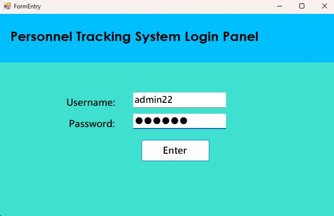
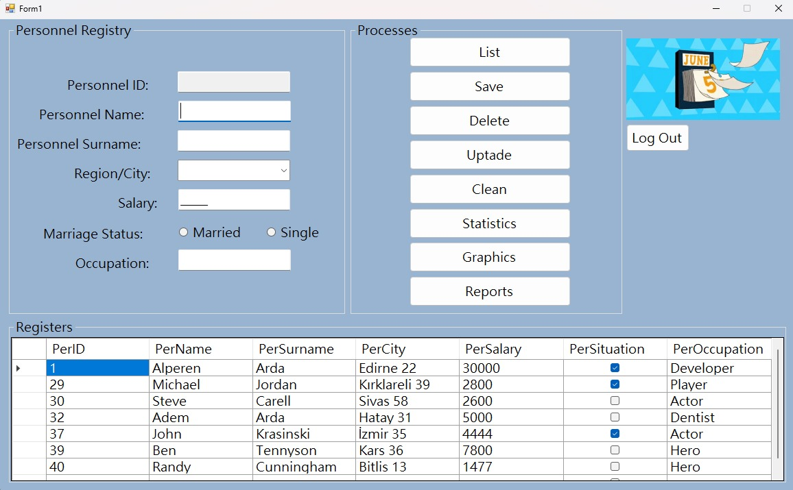
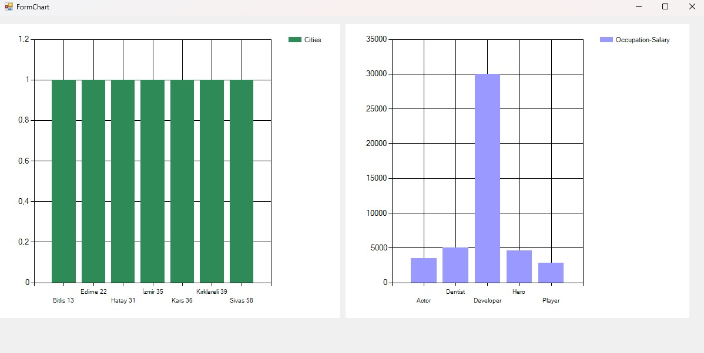
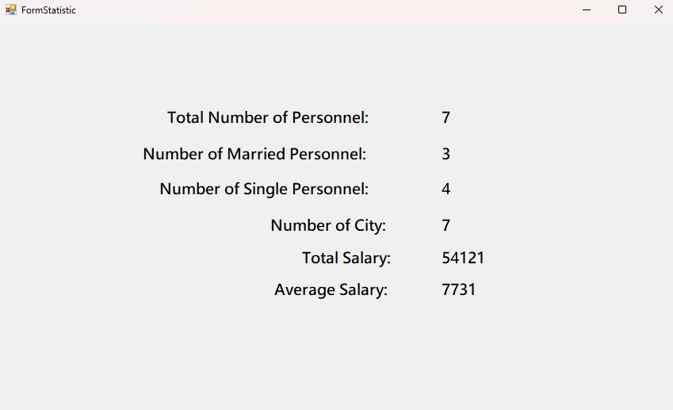

# PERSONNEL Registery with SQL

This project is a **Personnel Tracking System** designed to manage employee information, including adding, editing, and listing records.
Personnel Registery Project with SQL from Murat Yücedağ Udemy. This is my first medium-sized project that involves SQL.
Username: admin22
Password: 001122
You can use them to enter the system
I faced a problem about creating report page in the project. I would be happy if you fork or something.

## Features
- Add, delete, and update personnel records.
- List records and perform various operations (statistics, graphics).
- User login required for access.
- Keeps track of marital status and occupation of personnel.

## Technologies Used
- **C#** with Windows Forms for the UI.
- **MS SQL** for database management.
- **Visual Studio Code** as the development environment.

## Setup and Usage

### Requirements:
- Visual Studio Code or Visual Studio
- MS SQL Server
- .NET Framework

### Installation Steps:
1. Clone the project repository:
   ```bash
   git clone https://github.com/your-username/Personnel-Registery-with-SQL.git
2. Create a new database in MS SQL Server and update the connection string in the project’s configuration file.
3. Open the project in Visual Studio.
4. Run the project by pressing F5 or running the following command in the terminal
   ```bash
   dotnet run

### Database Setup:
1. Create a database in MS SQL Server:
   ```bash
   CREATE DATABASE PersonnelDB;
   ```
2. Use the SQL script provided in the project to create the necessary tables.
3. Update the connection string in the app.config file.

## Screenshots

### Personnel Login Panel


*This is the login panel for the Personnel Tracking System.*


### Personnel Registry Form


*This screenshot displays the personnel registry form where you can add or update personnel information.*


### Chart Representation


*This chart shows the comparison of cities and salaries for different occupations.*


### Personnel Statistics


*This image summarizes key statistics such as total personnel and average salary.*
